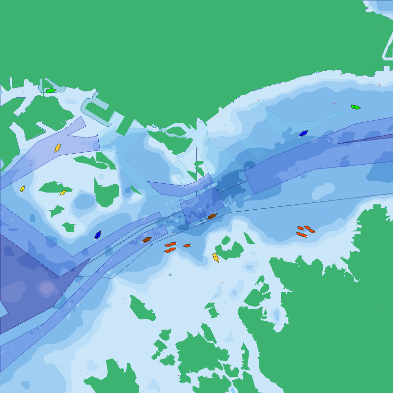
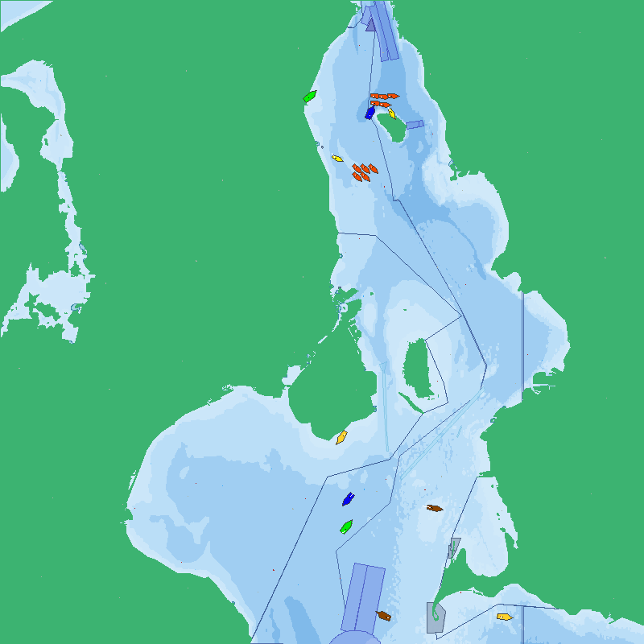
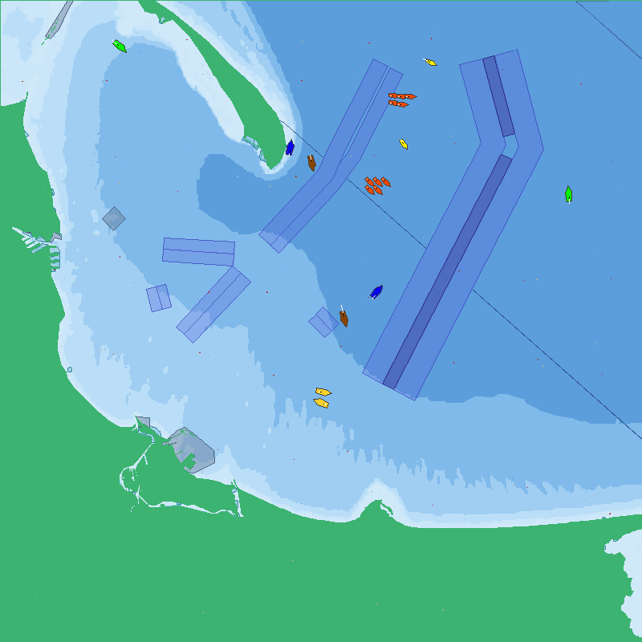
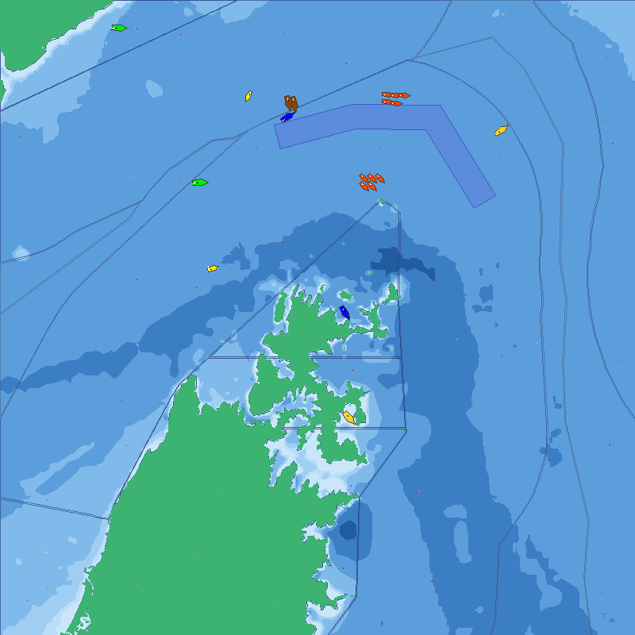
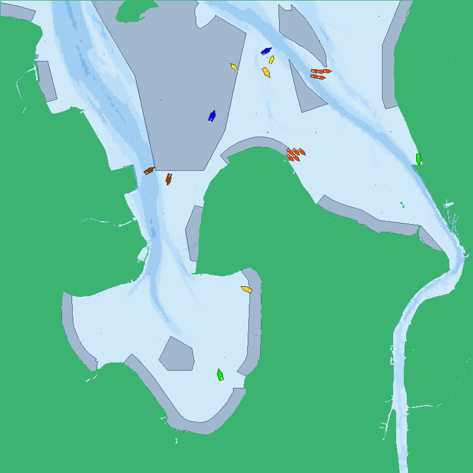
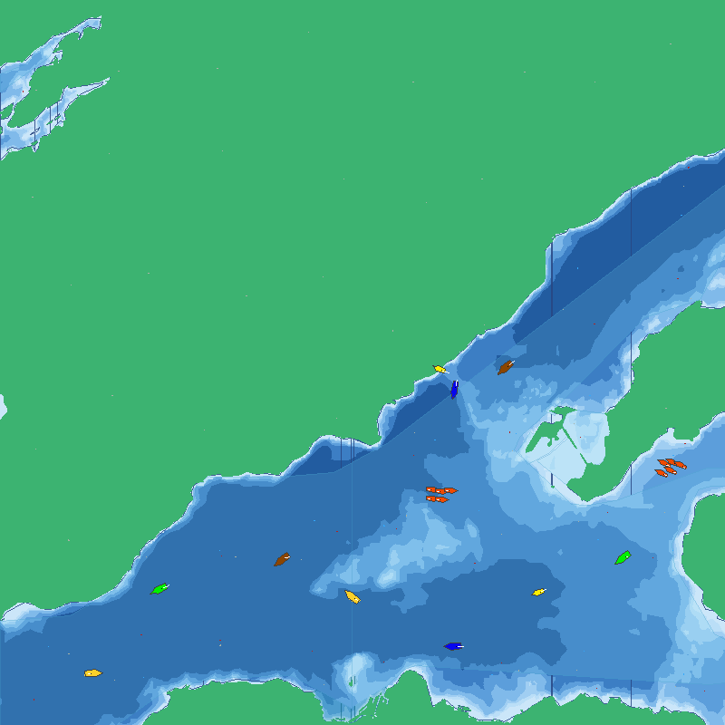

# cospy-data

Simulation assets (maps, weather, vessel traffic, regulations and scenarios) for maritime ports worldwide.

[cospy](https://github.com/sreekants/cospy) is the Co-Simulation Operating System (COS). It is a Python engine that runs large numbers of scenario simulations to test autonomous vessels. This repository holds the engine's data, so it contains no code.

## Quick start

Clone both repositories side by side:

```bash
git clone git@github.com:sreekants/cospy.git
git clone git@github.com:sreekants/cospy-data.git
cd cospy && poetry install
poetry run ../cospy-data/sim.sh trondheim
```

Any folder under `config/simulation/<country>/` is a valid location.

Full documentation: [docs/overview.md](docs/overview.md).

## Gallery

<table>
<tr>
<td align="center"><a href="docs/images/sg-singapore.png" target="_blank"></a><br><b>Singapore</b> · <code>sg/singapore</code></td>
<td align="center"><a href="docs/images/dk-copenhagen.png" target="_blank"></a><br><b>Copenhagen</b> · <code>dk/copenhagen</code></td>
</tr>
<tr>
<td align="center" width="50%"><a href="docs/images/po-gdansk.png" target="_blank"></a><br><b>Gdansk</b> · <code>po/gdansk</code></td>
<td align="center" width="50%"><a href="docs/images/om-hormuz.png" target="_blank"></a><br><b>Hormuz</b> · <code>om/hormuz</code></td>
</tr>
<tr>
<td align="center" width="50%"><a href="docs/images/de-bremen.png" target="_blank"></a><br><b>Bremen</b> · <code>de/bremen</code></td>
<td align="center" width="50%"><a href="docs/images/no-trondheim.png" target="_blank"></a><br><b>Trondheim</b> · <code>no/trondheim</code></td>
</tr>
</table>

All locations: [docs/gallery.md](docs/gallery.md).
