# ASV risk model (Kristensen et al. 2025, Fig. 2)

Generated from `asv_risk_model.xdsl` by `xdsl2md.py`. Node groups come from GeNIe node colours.

30 nodes, 33 arcs, 15 roots, 5 leaves.

## Network

```mermaid
flowchart TD
    classDef consequence fill:#FDE8CF,stroke:#9A5B00,color:#4A2B00,stroke-width:1px
    classDef hazard fill:#DDF1F5,stroke:#1E6B7B,color:#0C3540,stroke-width:1px
    classDef intermediate fill:#DCE9FB,stroke:#2A5EA8,color:#10305C,stroke-width:1px
    classDef input fill:#E8EEF7,stroke:#4A6A99,color:#1B2A44,stroke-width:1px
    classDef static fill:#ECEBE6,stroke:#6B6A63,color:#2E2E2A,stroke-width:1px
    comms_system_failure["Failure of communication system"]
    target_vessel_fails["Target vessel fails to recover"]
    autonomous_control_failure["Autonomous control failure"]
    manual_control_failure["Manual control failure"]
    own_vessel_fails["Own vessel fails to recover"]
    depth["Depth"]
    distance_to_shore["Distance to shore"]
    waterway_properties["Waterway properties"]
    wave_height["Wave height"]
    wind_speed["Wind speed"]
    environmental["Environmental conditions"]
    fail_recover_grounding["Failure of recovery from grounding course"]
    dcpa["DCPA"]
    tcpa["TCPA"]
    collision_encounter["Collision encounter properties"]
    fail_recover_collision["Failure of recovery from collision course"]
    auv_asv_distance["AUV/ASV distance"]
    loss_of_comms["Loss of ASV/AUV communication connection"]
    damage_auv["Damage to AUV"]
    humans_present["Humans present on other vessel"]
    size_other_vessel["Size of other vessel"]
    vessel_on_grounding["Vessel on grounding course"]
    grounding["Grounding"]
    target_on_collision["Target ship on collision course"]
    collision["Collision"]
    damage_asv["Damage to ASV"]
    damage_other_vessel["Damage to other vessel"]
    mission_failure["Mission failure"]
    humans_exposed["Humans exposed to collision risk"]
    harm_to_humans["Harm to humans"]
    manual_control_failure --> own_vessel_fails
    autonomous_control_failure --> own_vessel_fails
    distance_to_shore --> waterway_properties
    depth --> waterway_properties
    wind_speed --> environmental
    wave_height --> environmental
    environmental --> fail_recover_grounding
    own_vessel_fails --> fail_recover_grounding
    waterway_properties --> fail_recover_grounding
    dcpa --> collision_encounter
    tcpa --> collision_encounter
    collision_encounter --> fail_recover_collision
    target_vessel_fails --> fail_recover_collision
    environmental --> fail_recover_collision
    own_vessel_fails --> fail_recover_collision
    auv_asv_distance --> loss_of_comms
    comms_system_failure --> loss_of_comms
    loss_of_comms --> damage_auv
    vessel_on_grounding --> grounding
    fail_recover_grounding --> grounding
    target_on_collision --> collision
    fail_recover_collision --> collision
    collision --> damage_asv
    grounding --> damage_asv
    collision --> damage_other_vessel
    collision --> mission_failure
    grounding --> mission_failure
    loss_of_comms --> mission_failure
    size_other_vessel --> humans_exposed
    humans_present --> humans_exposed
    target_on_collision --> humans_exposed
    collision --> harm_to_humans
    humans_exposed --> harm_to_humans
    class damage_auv,damage_asv,damage_other_vessel,mission_failure,harm_to_humans consequence
    class loss_of_comms,grounding,collision hazard
    class own_vessel_fails,depth,distance_to_shore,waterway_properties,wave_height,wind_speed,environmental,fail_recover_grounding,dcpa,tcpa,collision_encounter,fail_recover_collision,auv_asv_distance,humans_present,size_other_vessel,vessel_on_grounding,target_on_collision,humans_exposed intermediate
    class comms_system_failure,target_vessel_fails,autonomous_control_failure,manual_control_failure static
```

| Group | Count |
|---|---|
| Consequence | 5 |
| Hazardous event | 3 |
| Probability-influencing | 18 |
| Static | 4 |

## Nodes

| Node | States | Parents |
|---|---|---|
| Failure of communication system | yes, no | - |
| Target vessel fails to recover | yes, no | - |
| Autonomous control failure | yes, no | - |
| Manual control failure | yes, no | - |
| Own vessel fails to recover | yes, no | Manual control failure, Autonomous control failure |
| Depth | critical, noncritical | - |
| Distance to shore | 10 states: state_1 … state_10 | - |
| Waterway properties | critical, noncritical | Distance to shore, Depth |
| Wave height | critical, noncritical | - |
| Wind speed | critical, noncritical | - |
| Environmental conditions | critical, noncritical | Wind speed, Wave height |
| Failure of recovery from grounding course | yes, no | Environmental conditions, Own vessel fails to recover, Waterway properties |
| DCPA | 10 states: state_1 … state_10 | - |
| TCPA | 10 states: state_1 … state_10 | - |
| Collision encounter properties | critical, noncritical | DCPA, TCPA |
| Failure of recovery from collision course | yes, no | Collision encounter properties, Target vessel fails to recover, Environmental conditions, Own vessel fails to recover |
| AUV/ASV distance | state_1, state_2, state_3, state_4, state_5 | - |
| Loss of ASV/AUV communication connection | yes, no | AUV/ASV distance, Failure of communication system |
| Damage to AUV | major, minor, none | Loss of ASV/AUV communication connection |
| Humans present on other vessel | many, limited | - |
| Size of other vessel | small, large | - |
| Vessel on grounding course | yes, no | - |
| Grounding | yes, no | Vessel on grounding course, Failure of recovery from grounding course |
| Target ship on collision course | yes, no | - |
| Collision | yes, no | Target ship on collision course, Failure of recovery from collision course |
| Damage to ASV | major, minor, none | Collision, Grounding |
| Damage to other vessel | major, minor, none | Collision |
| Mission failure | yes, no | Collision, Grounding, Loss of ASV/AUV communication connection |
| Humans exposed to collision risk | yes, no | Size of other vessel, Humans present on other vessel, Target ship on collision course |
| Harm to humans | fatality, none | Collision, Humans exposed to collision risk |
