# Location gallery

Each image was taken from a running simulation of the location, with its default traffic.
Click an image to see it at full size. To regenerate the images, see [SNIPSIM.md](../SNIPSIM.md).

<table>
<tr>
<td align="center" width="50%"><a href="images/be-antwerp.png" target="_blank">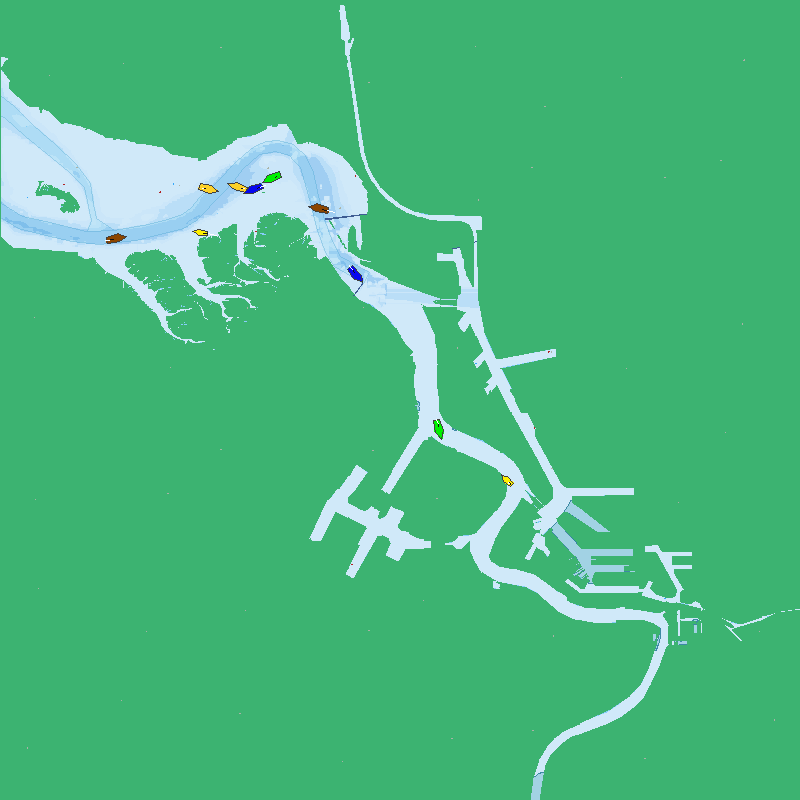</a> <b>Antwerp</b> · <code>be/antwerp</code></td>
<td align="center" width="50%"> <b>Bremen</b> · <code>de/bremen</code></td>
</tr>
<tr>
<td align="center"> <b>Copenhagen</b> · <code>dk/copenhagen</code></td>
<td align="center"><a href="images/es-barcelona.png" target="_blank">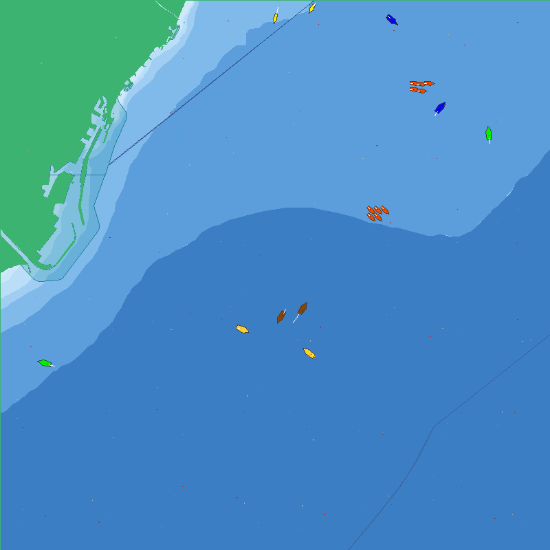</a> <b>Barcelona</b> · <code>es/barcelona</code></td>
</tr>
<tr>
<td align="center"><a href="images/es-valencia.png" target="_blank">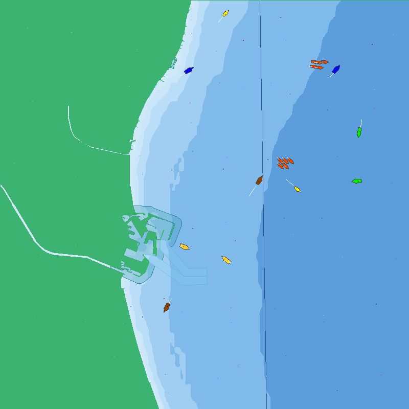</a> <b>Valencia</b> · <code>es/valencia</code></td>
<td align="center"><a href="images/fi-helsinki.png" target="_blank">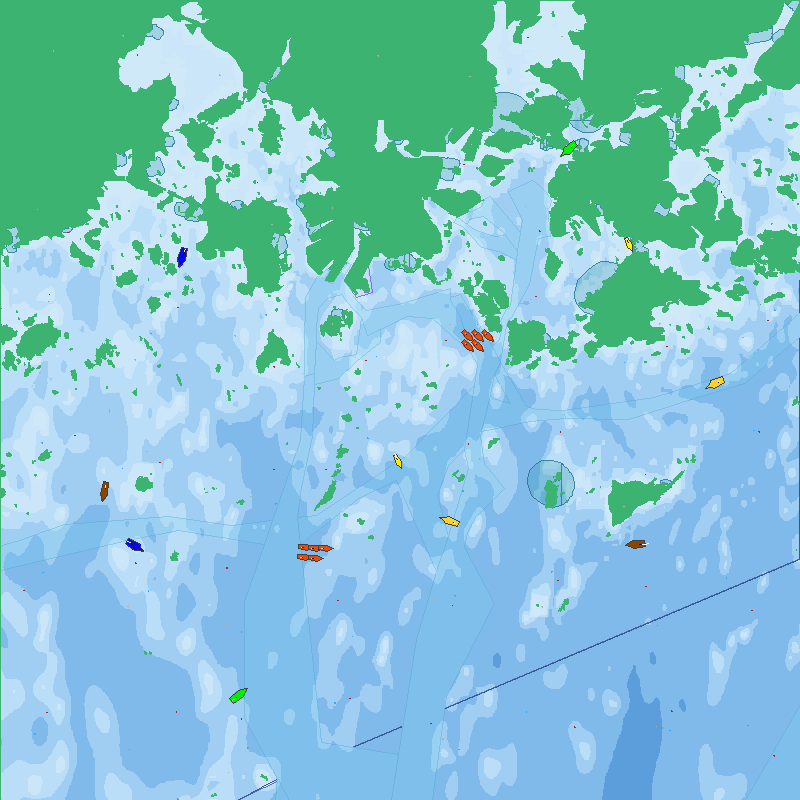</a> <b>Helsinki</b> · <code>fi/helsinki</code></td>
</tr>
<tr>
<td align="center"><a href="images/no-alesund.png" target="_blank">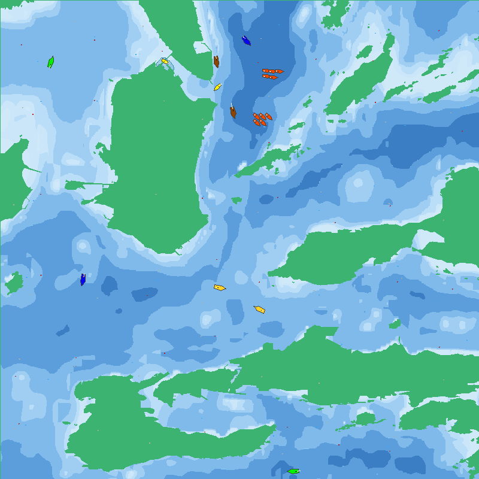</a> <b>Ålesund</b> · <code>no/alesund</code></td>
<td align="center"><a href="images/no-bergen.png" target="_blank">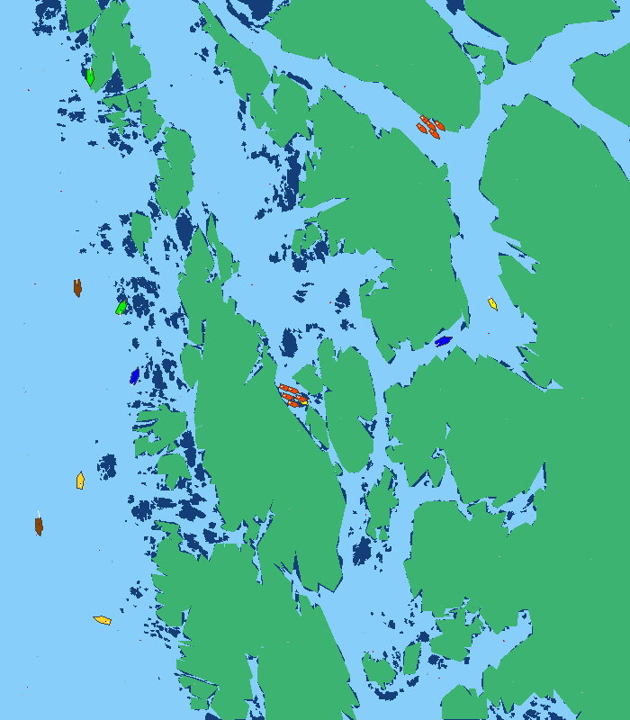</a> <b>Bergen</b> · <code>no/bergen</code></td>
</tr>
<tr>
<td align="center"><a href="images/no-oslo.png" target="_blank">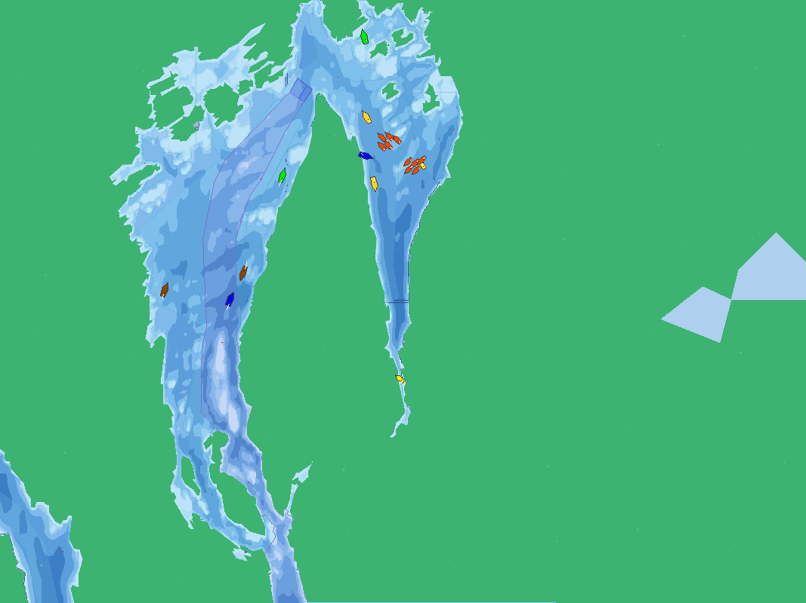</a> <b>Oslo</b> · <code>no/oslo</code></td>
<td align="center"><a href="images/no-sture.png" target="_blank">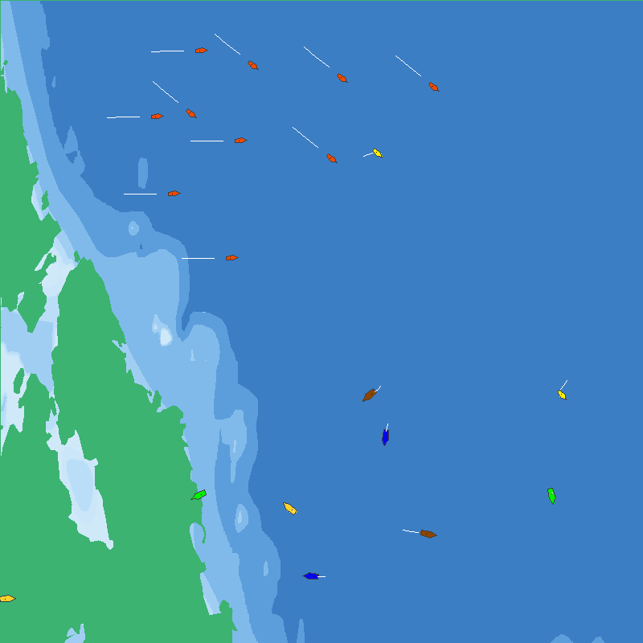</a> <b>Sture</b> · <code>no/sture</code></td>
</tr>
<tr>
<td align="center"><a href="images/no-tautra.png" target="_blank">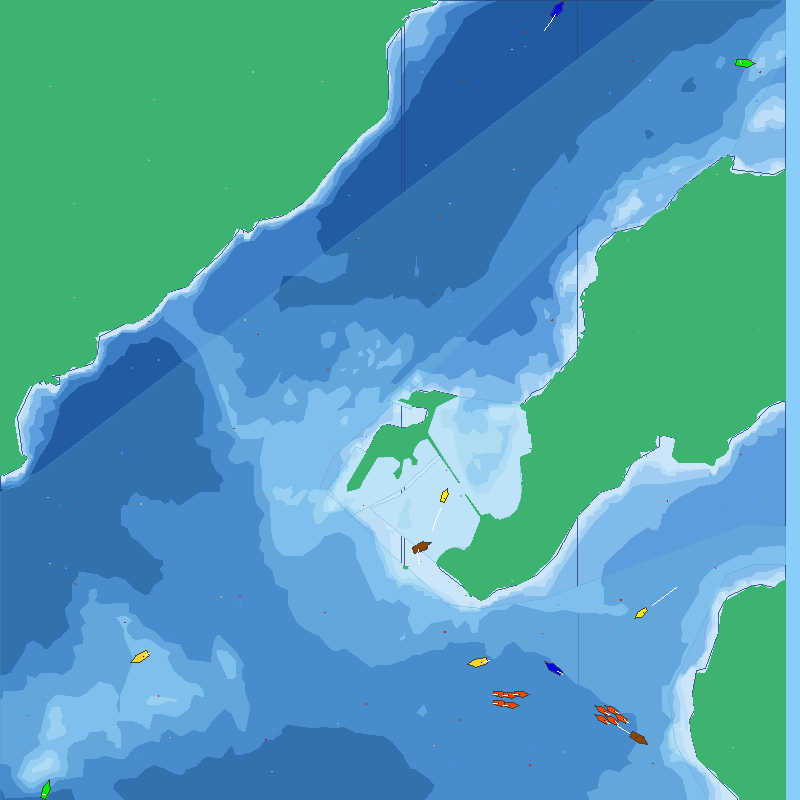</a> <b>Tautra</b> · <code>no/tautra</code></td>
<td align="center"> <b>Trondheim</b> · <code>no/trondheim</code></td>
</tr>
<tr>
<td align="center"> <b>Hormuz</b> · <code>om/hormuz</code></td>
<td align="center"> <b>Gdańsk</b> · <code>po/gdansk</code></td>
</tr>
<tr>
<td align="center"> <b>Singapore</b> · <code>sg/singapore</code></td>
<td align="center"><a href="images/tk-canakkale.png" target="_blank">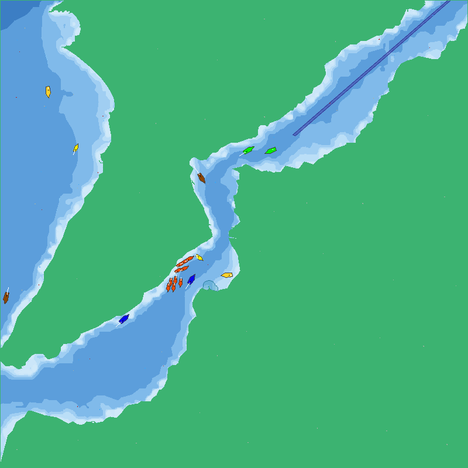</a> <b>Çanakkale</b> · <code>tk/canakkale</code></td>
</tr>
<tr>
<td align="center"><a href="images/tk-istanbul.png" target="_blank">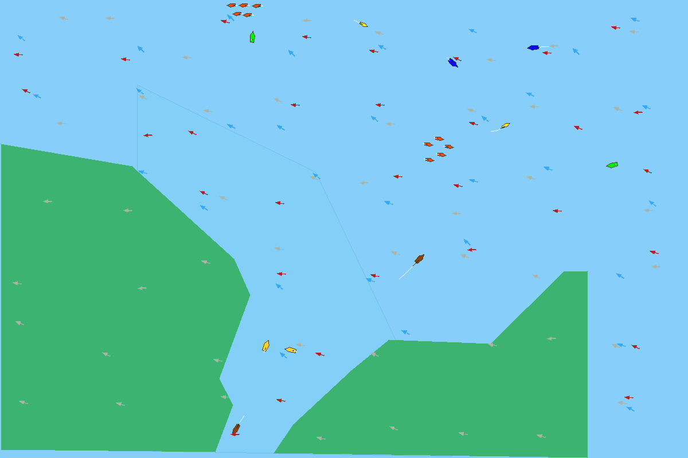</a> <b>Istanbul</b> · <code>tk/istanbul</code></td>
<td align="center"><a href="images/tk-kavak-kandilli.png" target="_blank">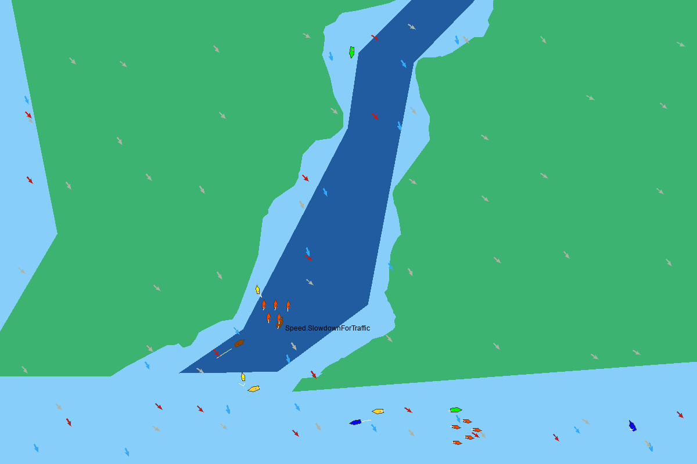</a> <b>Kavak–Kandilli</b> · <code>tk/kavak-kandilli</code></td>
</tr>
<tr>
<td align="center"><a href="images/tk-turkeli.png" target="_blank">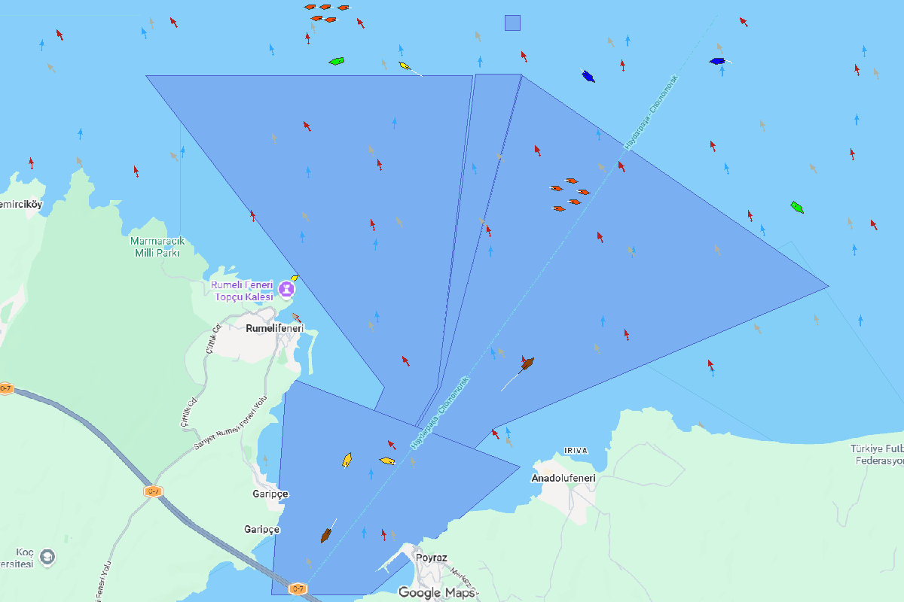</a> <b>Türkeli</b> · <code>tk/turkeli</code></td>
<td></td>
</tr>
</table>
